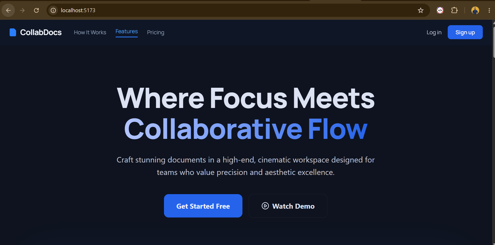
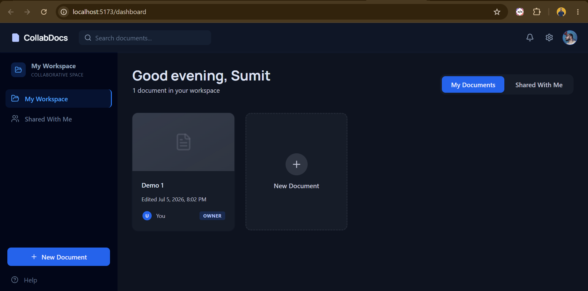
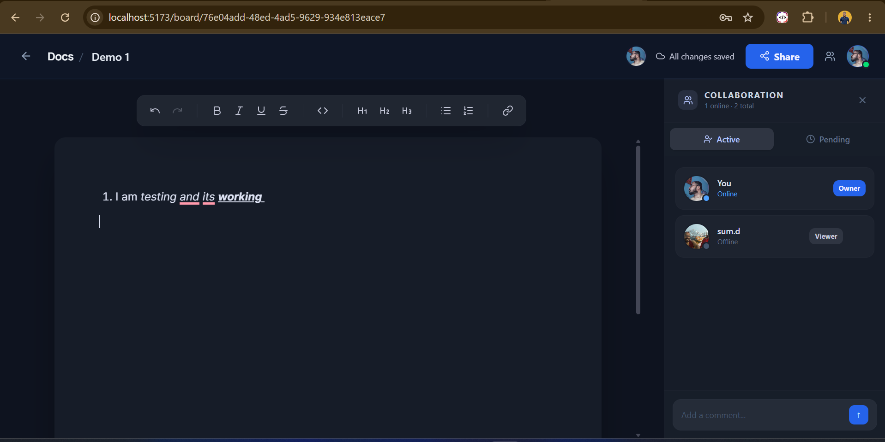
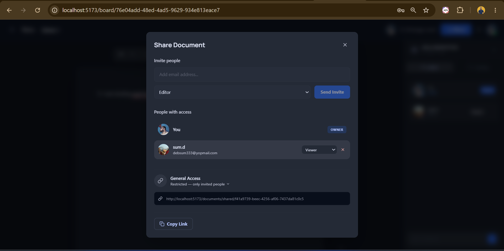
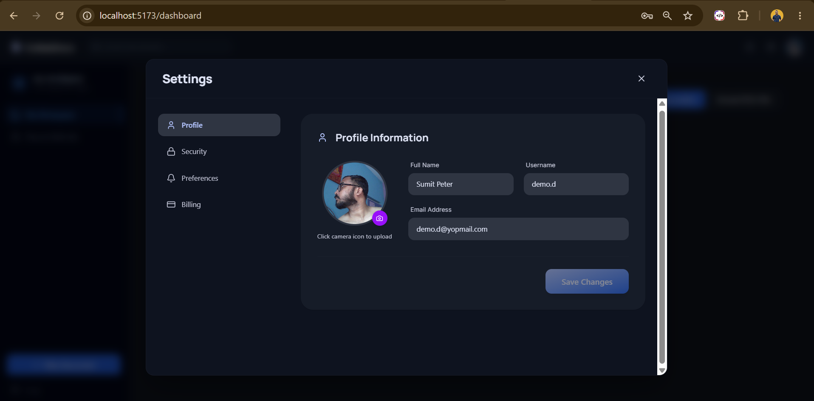

# 📄 CollabDocs — Frontend
 
A Google Docs–style **real-time collaborative document editor** built with **React + Vite**. Supports live multi-user editing, rich text formatting via TipTap, presence avatars, collaborator management, and email-based invite flows. Pairs with the [collab-app-backend](https://github.com/debnath96sumit/collab-app-backend) service.
 
---
 
## ✨ Features
 
- **Real-time Collaboration** — Multiple users edit the same document simultaneously via Socket.IO with zero-latency sync
- **Rich Text Editor** — Full TipTap-powered editor with bold, italic, underline, headings, lists, and more
- **Presence Avatars** — See who is currently editing the document with live presence indicators
- **"Who Is Typing"** — Real-time typing indicators powered by dedicated `typing-start` / `typing-stop` socket events
- **Document Management** — Create, rename, delete, and organize personal and shared documents from a dashboard
- **Collaborator Invitations** — Invite users by email; pending invites expire after 7 days; existing users get instant access
- **Role-Based Access** — Owner / Editor / Commenter / Viewer roles with permission-gated UI controls
- **Link Sharing** — Public / restricted document access via shareable tokens
- **Auto-Save** — Debounced content sync saves edits silently in the background
- **Profile & Settings** — Update name, username, email, and avatar with a live preview
- **JWT Auth with Refresh Rotation** — Seamless token refresh handled transparently by Axios interceptors
- **Toast Notifications** — Lightweight custom toaster (no external library) with success / error / warning / info types
- **Responsive UI** — Mobile-first layout with slide-in collab panel, icon-only buttons on small screens, expanding search overlay
---
 
## 🖼️ Screenshots
 
| Home / Landing | Dashboard | Editor |
|---|---|---|
|  |  |  |
 
| Share Modal | Settings | Invitation |
|---|---|---|
|  |  |  |
 
---
 
## 🏗️ Tech Stack
 
| Layer | Technology |
|---|---|
| Framework | React 19 (JavaScript) |
| Build Tool | Vite |
| Styling | Tailwind CSS v4 (custom design tokens) |
| Rich Text Editor | TipTap |
| Real-time | Socket.IO Client |
| HTTP Client | Axios (with interceptor-based token refresh) |
| Forms | React Hook Form + Zod |
| Routing | React Router v6 |
| Icons | Lucide React |
| Backend | [collab-app-backend](https://github.com/debnath96sumit/collab-app-backend) (NestJS) |
 
---
 
## 📁 Project Structure
 
```
src/
├── assets/                    # Static assets
├── components/
│   ├── auth/                  # PublicRoute guard
│   ├── dashboard/
│   │   ├── documents/         # DocumentCard, DocumentGrid, DocumentCardMenu
│   │   ├── layout/            # DashboardLayout, DashboardHeader, Sidebar
│   │   └── modals/            # CreateDocModal, RenameDocModal, DeleteDocModal
│   ├── editor/
│   │   ├── EditorHeader.jsx   # Title input, presence avatars, save status, share btn
│   │   ├── EditorCanvas.jsx   # TipTap editor wrapper
│   │   ├── EditorToolbar.jsx  # Rich text formatting toolbar
│   │   ├── CollabPanel.jsx    # Slide-in active/pending collaborators panel
│   │   ├── PresenceAvatars.jsx
│   │   └── SaveStatus.jsx
│   ├── home/                  # Landing page sections (Navbar, Hero, Features, Pricing, CTA, Footer)
│   ├── settings/              # SettingsModal, SettingsBody (Profile, Security, Preferences)
│   ├── Loading.jsx
│   ├── ProtectedRoute.jsx
│   ├── ShareModal.jsx
│   └── Toaster.jsx
├── context/
│   ├── AuthContext.js         # Context definition + useAuth hook
│   └── AuthProvider.jsx       # Auth state, login, logout, refreshUser, updateProfileDetails
├── helpers/
│   └── index.js               # formatDate, getInitials
├── hooks/
│   └── useSocket.js           # Generic socket hook (connect / emit / on / off)
├── lib/
│   └── validations/
│       ├── auth.js            # Zod schemas: loginSchema, registerSchema
│       └── user.js            # Zod schemas: updateProfileSchema, changePasswordSchema
├── pages/
│   ├── Home.jsx
│   ├── Login.jsx
│   ├── Register.jsx
│   ├── Dashboard.jsx
│   ├── Editor.jsx
│   ├── SharedDocument.jsx
│   ├── NotFound.jsx
│   └── invitation/
│       └── accept.jsx
└── utils/
    ├── api.js                 # AuthAPI, UserAPI, DocumentAPI, CollaboratorAPI
    ├── axiosInstance.js       # Axios + request/response interceptors (token refresh queue)
    └── toaster.js             # pushToast, subscribeToToasts, TOAST_TYPES
```
 
---
 
## 🚀 Getting Started
 
### Prerequisites
 
- Node.js >= 18
- npm or yarn
- The [collab-app-backend](https://github.com/debnath96sumit/collab-app-backend) running locally or deployed
### Installation
 
```bash
# Clone the repository
git clone https://github.com/debnath96sumit/collab-app-frontend.git
cd collab-app-frontend
 
# Install dependencies
npm install
```
 
### Environment Variables
 
Create a `.env` file in the project root:
 
```bash
cp .env.example .env
```
 
```env
VITE_API_URL=http://localhost:4000    # URL of your collab-app-backend (no trailing slash)
```
 
### Running Locally
 
```bash
# Development mode with hot reload
npm run dev
 
# Build for production
npm run build
 
# Preview the production build
npm run preview
```
 
The app will be available at `http://localhost:5173` by default.
 
---
 
## 🔌 Backend Connection
 
This frontend is designed to work with **collab-app-backend** — a NestJS service that handles:
 
- JWT authentication with refresh token rotation
- Document CRUD and real-time editing via Socket.IO
- Collaborator invite flow with email notifications (Nodemailer)
- BullMQ job queue for async saves and email delivery
- Avatar file uploads served as static assets
👉 [View the backend repository](https://github.com/debnath96sumit/collab-app-backend)
 
**API base:** `VITE_API_URL/api/v1/`  
**WebSocket namespace:** `VITE_API_URL/document-edits`
 
---
 
## ⚙️ Key Implementation Details
 
### Auth Flow
 
- Access tokens are stored in `localStorage` and attached to every request via Axios request interceptor.
- On a `401` response, the interceptor pauses the failed request, refreshes the access token using the stored refresh token, then replays all queued requests — transparently, without the user seeing any error.
- On logout, the access token is blacklisted server-side and both tokens are cleared from `localStorage`.
### Real-time Editing
 
- The editor connects to the `/document-edits` Socket.IO namespace using the JWT in the `auth` handshake.
- Content changes are debounced (1 s) before emitting `editDocument` to avoid flooding the server.
- Incoming `documentUpdated` events use `editor.commands.setContent(content, false)` — the `false` flag suppresses the `onUpdate` callback to prevent echo loops.
- Typing indicators are driven by dedicated `typing-start` / `typing-stop` events with `cursorDecayTimers` for cleanup.
### Token Refresh Race Condition
 
- A single `isRefreshing` flag + `failedQueue` array ensures that concurrent 401s result in exactly one refresh call, not N parallel refresh calls.
### Toolbar Focus Preservation
 
- Toolbar buttons use `onMouseDown` + `e.preventDefault()` so the editor never loses focus before the formatting command fires.
---
 
## 🗺️ App Routes
 
| Path | Component | Access |
|---|---|---|
| `/` | `Home` | Public (redirects if logged in) |
| `/login` | `Login` | Public |
| `/register` | `Register` | Public |
| `/dashboard` | `Dashboard` | Protected |
| `/board/:id` | `Editor` | Protected |
| `/document/shared/:shareToken` | `SharedDocument` | Public |
| `/invitation/accept?token=...` | `InvitationAccept` | Public |
| `*` | `NotFound` | — |
 
---
 
## 🧩 Component Highlights
 
### `AuthProvider`
Manages global auth state (`user`, `token`, `refreshToken`). Exposes `login`, `signup`, `logout`, `refreshUser`, and `updateProfileDetails`. The `loading` flag gates routing decisions to avoid blank screens during the initial profile fetch.
 
### `axiosInstance`
Centralised HTTP layer with:
- Bearer token injection on every request
- Automatic token refresh on `401` with request queuing
- `NO_REFRESH_ROUTES` (show toast, skip refresh) and `SILENT_ERROR_ROUTES` (suppress toast entirely) classifications
### `CollabPanel`
Slide-in right drawer showing **Active** and **Pending** collaborator tabs. Active users are enriched with the Socket.IO presence list to show "Editing..." vs "Idle" status.
 
### `ShareModal`
Full share dialog with invite-by-email, role selector, people-with-access list (hover to change role or remove), general access toggle (public/restricted), and copy-link button.
 
### `SettingsBody`
Tabbed settings panel (Profile / Security / Preferences / Billing) built with React Hook Form + Zod. Profile updates hit a `multipart/form-data` endpoint; avatar file input uses a hidden `<input type="file">` triggered by the camera icon button.
 
---
 
## 🤝 Contributing
 
Contributions, issues, and feature requests are welcome. Feel free to check the [issues page](https://github.com/debnath96sumit/collab-app-frontend/issues).
 
1. Fork the repository
2. Create your feature branch: `git checkout -b feature/your-feature`
3. Commit your changes: `git commit -m 'feat: add your feature'`
4. Push to the branch: `git push origin feature/your-feature`
5. Open a Pull Request
---
 
## 👨‍💻 Author
 
**Sumit Debnath**
 
- LinkedIn: [linkedin.com/in/sumit-debnath-2214a6144](https://linkedin.com/in/sumit-debnath-2214a6144)
- X: [@SumitDeb96](https://x.com/SumitDeb96)
---
 
## 📄 License
 
This project is open source and available under the [MIT License](./LICENSE).